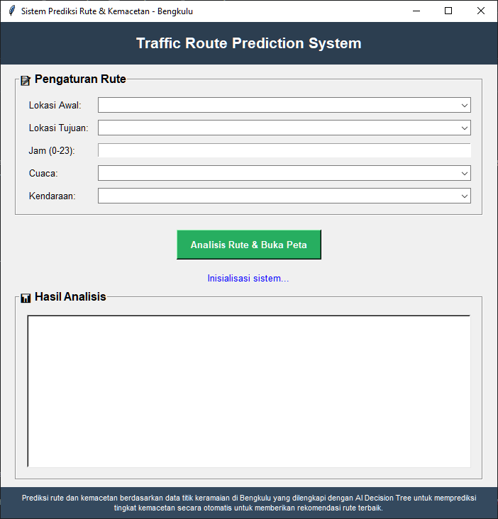
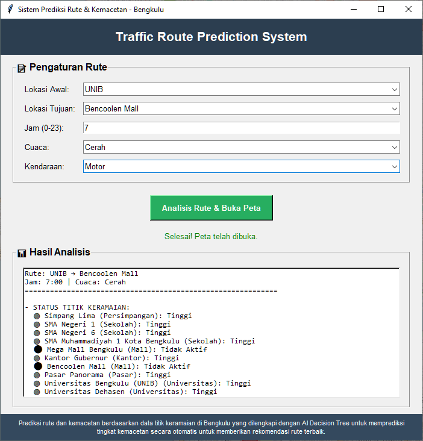
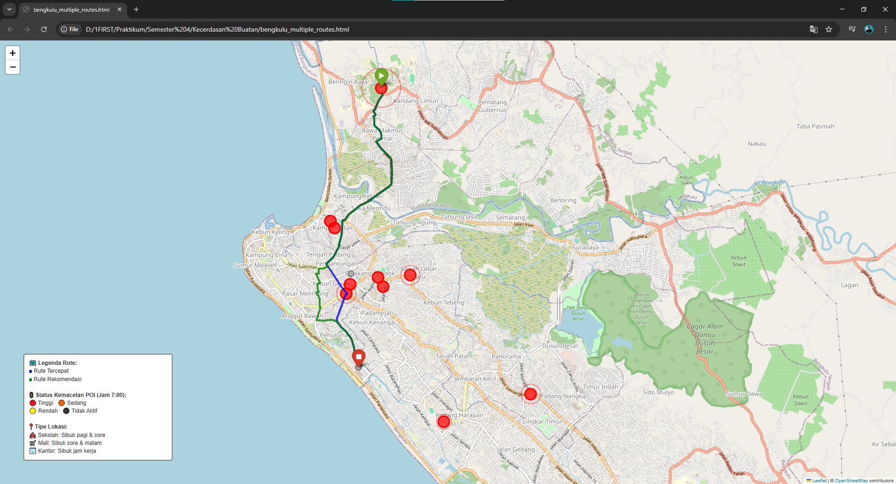

# Smart City: AI Prediksi Kemacetan Lalu Lintas Bengkulu

## 🏛️ Deskripsi Proyek

Aplikasi ini merupakan prototipe sistem prediksi kemacetan lalu lintas dan rekomendasi rute berbasis kecerdasan buatan (AI) untuk kota Bengkulu. Sistem ini memanfaatkan data graf jalan dari OpenStreetMap, titik keramaian (POI), serta model AI Decision Tree untuk memprediksi tingkat kemacetan dan memberikan saran rute terbaik secara interaktif.

---

## 👥 Anggota Kelompok 8
| Nama                     | NPM        | GitHub                                      |
|--------------------------|------------|---------------------------------------------|
| Koreza Almukadima        | G1A023011  | [Zaa](https://github.com/Korezaalmukadima)  |
| Sidik Bagus Firmansyah   | G1A023027  | [Sidiqkun](https://github.com/Sidiqkun)     |
| Muhammad Ryan Al-Habsy   | G1A023093  | [Starcres](https://github.com/Starcres)     |

---

## 🧠 1. Relevansi & Justifikasi Model AI

### Model yang Dipilih: **Decision Tree (Pohon Keputusan)**. 
**Alasan Pemilihan:**
Decision Tree dipilih karena mudah diimplementasikan, cepat dalam inferensi, dan dapat menangani data tabular sederhana seperti jam, cuaca, dan jumlah titik keramaian aktif. Model ini cocok untuk prototipe sistem prediksi kemacetan berbasis fitur-fitur yang tersedia tanpa memerlukan data historis dalam jumlah besar.

Model tidak menggunakan machine learning berbasis training dataset besar, namun berbasis logika deterministik.

### Logika Decision Tree:
```
IF jam IN [6-9, 15-18] AND cuaca == "Hujan" AND poi_aktif >= 2:
    kemacetan = "Tinggi"
ELIF jam IN [6-9, 15-18] OR poi_aktif >= 2:
    kemacetan = "Sedang"  
ELSE:
    kemacetan = "Rendah"
```

---

## 📊 2. Data & Pengelolaan

### Jenis Data:

* Titik keramaian (POI): Data manual, terdiri dari sekolah, mall, kantor, pasar, dan universitas, lengkap dengan jam aktif.
* contoh :
  ```python
  {
    "nama": "SMA Negeri 1",
    "lat": -3.7956820399891193,
    "lon": 102.26669585378794,
    "radius": 120,
    "severity": "medium",
    "jam_aktif": [
      {"start": 6, "end": 9, "level": "high"},
      {"start": 15, "end": 18, "level": "high"}
    ]
  }
  ```
* Graf jalan: OpenStreetMap (diambil otomatis dengan OSMnx).
* Data cuaca dan waktu: Input manual dari user.

### Pengumpulan Data:

* Simulasi menggunakan **data statik** yang dikodekan langsung dalam sistem
* Koordinat dan nama lokasi berdasarkan asumsi wilayah Bengkulu

### Praproses:

* POI memiliki atribut jam aktif dan dapat dikembangkan dengan atribut hari aktif.
* Data training AI disimulasikan berdasarkan kombinasi jam, cuaca, dan jumlah POI aktif.
* Data graf disimpan dalam cache (bengkulu_graph.pkl) untuk efisiensi.
* Semua data diolah secara terstruktur sebelum digunakan untuk prediksi dan visualisasi.
* Untuk optimisasi Graf Caching graf ke file `bengkulu_graph.pkl` untuk menghindari download ulang

---

## 🛋️ 3. Desain Sistem (Logis dan Terstruktur)

### Arsitektur Sistem:

```
[Input User] → [Data Processing] → [AI Prediction] → [Route Calculation] → [Visualization]
     ↓              ↓                    ↓                ↓                    ↓
 Lokasi, Jam,   Cek POI Aktif,     Decision Tree    Multiple Routes      Folium Map
 Cuaca, Jenis   Faktor Cuaca,      Prediction       (Fastest, Recommended,  + Analysis
 Kendaraan      Waktu Rush Hour                     Alternative)
```

### Alur Sistem:

1. User memilih lokasi awal, tujuan, kendaraan, jam, dan cuaca.
2. Sistem menghitung **faktor kemacetan** berdasarkan:

   * Banyaknya titik padat aktif
   * Apakah sedang jam sibuk (pagi/sore)
   * Cuaca (jika hujan menambah delay)
3. Sistem menjalankan logika decision-tree sederhana untuk:

   * Menilai apakah jalur utama kemungkinan macet
   * Merekomendasikan jalur alternatif
4. **Visualisasi rute** ditampilkan dengan folium (peta interaktif)
5. Sistem memberikan **analisis AI** dan **kesimpulan kemacetan**

### Diagram Alur:

```
START → Input Validation → Load Graph → Precompute POI
  ↓
Check POI Activity → Apply Traffic Conditions → Calculate Routes
  ↓
Decision Tree Prediction → Route Comparison → Generate Analysis
  ↓
Create Interactive Map → Display Results → END
```

---
## 🖥️ 4. Tampilan Antarmuka

### 🔐 GUI

### 🔍 Hasil dan Analisis

### 🗺️ Visualisasi Map dengan OpenStreetMap (OSM)


---

## 🎯 5. Evaluasi Sistem & Metrik

### Evaluasi dilakukan berdasarkan:

* Sistem diuji dengan berbagai kombinasi input (jam, cuaca, jumlah POI aktif) untuk melihat perubahan prediksi kemacetan dan rekomendasi rute.
* Hasil prediksi AI (Decision Tree) ditampilkan secara eksplisit di hasil analisis.
* **Status rute rekomendasi** apakah benar menjauhi titik padat

### Metrik Evaluasi:

* Untuk prototipe ini, evaluasi dilakukan secara kualitatif dengan membandingkan hasil prediksi dengan ekspektasi logis (misal: kemacetan tinggi saat rush hour dan banyak POI aktif).

---

## 🚀 6. Fitur & Pengembangan

### Fitur :

* Simulasi cuaca & waktu yang mengubah status POI
* Visualisasi status POI dan rute pada peta interaktif.
* Integrasi AI Decision Tree untuk prediksi kemacetan secara otomatis.

### Potensi Pengembangan:

* Integrasi dengan data **cuaca API & sensor traffic**
* Sinkronisasi dengan Google Maps / Leaflet real-time
* Aplikasi mobile berbasis Flutter
* Sistem dapat dikembangkan dengan menambah atribut hari aktif pada POI agar prediksi lebih realistis (misal: sekolah/kantor tidak aktif saat weekend).
* Integrasi data real-time (sensor lalu lintas, crowdsourcing).
* Penggunaan model AI lain (misal: Neural Network) jika data historis tersedia.

---

## 📚 7. Cara Menjalankan

### **Persyaratan Sistem:**
- Python 3.7+
- RAM minimum 4GB
- Koneksi internet untuk download peta pertama kali

### **Instalasi:**

1. **Clone Repository**
```bash
git clone https://github.com/Sidiqkun/Smartcity-Bengkulu-Traffic-AI.git
cd Smartcity-Bengkulu-Traffic-AI
```

2. **Install Dependencies**
```bash
pip install osmnx networkx geopy folium scikit-learn
```

3. **Jalankan Aplikasi**
```bash
python smartcity_traffic_prediction_bengkulu.py
```

### **Penggunaan:**
1. Pilih lokasi awal dan tujuan dari dropdown
2. Masukkan jam perjalanan (0-23)
3. Pilih kondisi cuaca
4. Pilih jenis kendaraan
5. Klik "Analisis Rute & Buka Peta"
6. Tunggu hingga peta terbuka di browser

### **Troubleshooting:**
- Jika download peta gagal, coba koneksi internet yang lebih stabil
- File cache `bengkulu_graph.pkl` akan terbuat otomatis
- Untuk reset cache, hapus file `bengkulu_graph.pkl`

---

## 🎯 8. KESIMPULAN

Sistem AI prediksi kemacetan lalu lintas Bengkulu ini berhasil mengintegrasikan multiple teknologi (Decision Tree, Network Analysis, Geospatial Processing) untuk memberikan solusi routing yang intelligent dan user-friendly. 

---

## 🌍 Links & Resources

- **GitHub Repository**: https://github.com/Sidiqkun/Smartcity-Bengkulu-Traffic-AI.git
- **Documentation**: README.md (this file)

---

## 📞 Contact Information

Untuk pertanyaan atau kolaborasi lebih lanjut, silakan hubungi:

- **Sidik Bagus Firmansyah**: sidikbagus46@gmail.com  
- **Koreza Almukadima**: zonevista860@gmail.com
- **Muhammad Ryan Al-Habsy**: mryanalhabsy@gmail.com

---

*Developed with ❤️ for Smart City Bengkulu Initiative*
*Universitas Bengkulu - Fakultas Teknik - 2024*
