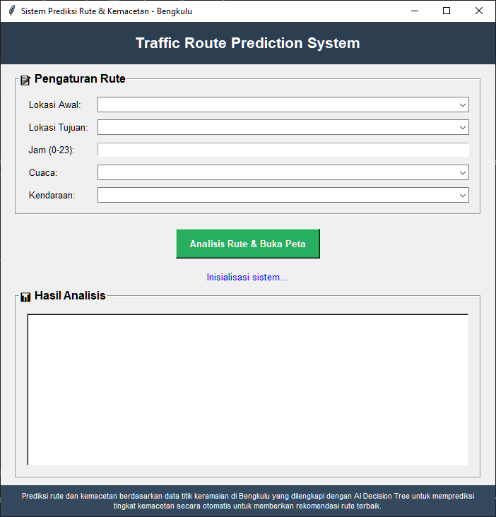
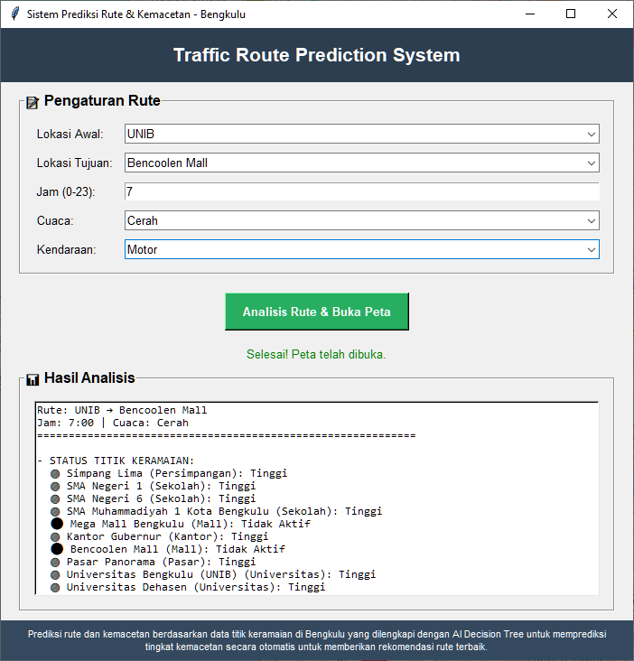

# Smart City: AI Prediksi Kemacetan Lalu Lintas Bengkulu

## 🏛️ Deskripsi Proyek

Aplikasi ini merupakan prototipe sistem prediksi kemacetan lalu lintas dan rekomendasi rute berbasis kecerdasan buatan (AI) untuk kota Bengkulu. Sistem ini memanfaatkan data graf jalan dari OpenStreetMap, titik keramaian (POI), serta model AI Decision Tree untuk memprediksi tingkat kemacetan dan memberikan saran rute terbaik secara interaktif.

---

## 👥 Anggota Kelompok 8
| Nama                     | NPM        | GitHub                                      |
|--------------------------|------------|---------------------------------------------|
| Koreza Almukadima        | G1A023011  | [Zaa](https://github.com/Korezaalmukadima)  |
| Sidik Bagus Firmansyah   | G1A023027  | [Sidiqkun](https://github.com/Sidiqkun)     |
| Muhammad Ryan Al-Habsy   | G1A023093  | [Starcres](https://github.com/Starcres)     |

---

## 🧠 1. RELEVANSI & JUSTIFIKASI MODEL AI

### Model yang Dipilih: **Decision Tree (Pohon Keputusan)**

**Alasan Pemilihan:**
- **Mudah Diimplementasikan**: Decision Tree cocok untuk prototipe karena tidak memerlukan training data dalam jumlah besar
- **Interpretable**: Hasil prediksi mudah dipahami dan dijelaskan kepada pengguna
- **Cepat dalam Inferensi**: Cocok untuk aplikasi real-time yang membutuhkan respons cepat  
- **Handling Data Tabular**: Efektif menangani data terstruktur seperti jam, cuaca, dan jumlah POI aktif
- **Tidak Memerlukan Normalisasi**: Data dengan skala berbeda dapat langsung diproses

### Logika Decision Tree:
```
IF jam IN [6-9, 15-18] AND cuaca == "Hujan" AND poi_aktif >= 2:
    kemacetan = "Tinggi"
ELIF jam IN [6-9, 15-18] OR poi_aktif >= 2:
    kemacetan = "Sedang"  
ELSE:
    kemacetan = "Rendah"
```

**Keunggulan untuk Studi Kasus Bengkulu:**
- Sesuai dengan karakteristik kota kecil-menengah dengan pola kemacetan yang dapat diprediksi
- Dapat mengakomodasi jam sibuk lokal (sekolah, kantor, pasar)
- Fleksibel untuk menambah variabel baru (hari libur, event khusus)

---

## 📊 2. DATA & PENGELOLAAN

### **A. Jenis Data:**

#### 1. **Data Titik Keramaian (POI)**
- **Jenis**: Sekolah, mall, kantor, pasar, universitas
- **Atribut**: Nama, koordinat, radius dampak, jam aktif, tingkat severity
- **Format**: Dictionary dengan jadwal aktivitas per jam
- **Contoh**:
  ```python
  {
    "nama": "SMA Negeri 1",
    "lat": -3.7956820399891193,
    "lon": 102.26669585378794,
    "radius": 120,
    "severity": "medium",
    "jam_aktif": [
      {"start": 6, "end": 9, "level": "high"},
      {"start": 15, "end": 18, "level": "high"}
    ]
  }
  ```

#### 2. **Data Graf Jalan**
- **Sumber**: OpenStreetMap (OSMnx library)
- **Tipe**: Network graph dengan node dan edge
- **Atribut**: Panjang jalan, tipe jalan, koordinat
- **Coverage**: Wilayah Kota Bengkulu

#### 3. **Data Kondisi Eksternal**
- **Cuaca**: Cerah, Mendung, Hujan (input manual)
- **Waktu**: Jam 0-23 (input pengguna)
- **Jenis Kendaraan**: Motor, Mobil (mempengaruhi kecepatan)

### **B. Metode Pengumpulan Data:**

#### 1. **Data Primer**
- Survei manual lokasi POI di Bengkulu
- Observasi jam sibuk setiap tipe lokasi
- Identifikasi radius dampak kemacetan

#### 2. **Data Sekunder**
- OpenStreetMap untuk peta jalan
- Asumsi pola kemacetan berdasarkan karakteristik kota

### **C. Praproses Data:**

#### 1. **Optimasi Graf**
- Caching graf ke file `bengkulu_graph.pkl` untuk menghindari download ulang
- Simplifikasi graf untuk efisiensi komputasi
- Precompute edges yang terdampak setiap POI

#### 2. **Normalisasi POI**
- Standarisasi format jam aktif
- Kategorisasi severity level (low, medium, high)
- Mapping activity level per jam

#### 3. **Simulasi Data Training**
- Generate kombinasi [jam, cuaca, poi_aktif] → tingkat kemacetan
- Labeling berdasarkan aturan logis
- Total 288 data point untuk training Decision Tree

---

## 🛠️ 3. DESAIN SISTEM (LOGIS DAN TERSTRUKTUR)

### **A. Arsitektur Sistem:**

```
[Input User] → [Data Processing] → [AI Prediction] → [Route Calculation] → [Visualization]
     ↓              ↓                    ↓                ↓                    ↓
 Lokasi, Jam,   Cek POI Aktif,     Decision Tree    Multiple Routes      Folium Map
 Cuaca, Jenis   Faktor Cuaca,      Prediction       (Fastest, Recommended,  + Analysis
 Kendaraan      Waktu Rush Hour                     Alternative)
```

### **B. Alur Kerja Sistem:**

#### **Phase 1: Input & Validation**
1. User input lokasi awal dan tujuan
2. Pilih jenis kendaraan dan jam perjalanan
3. Tentukan kondisi cuaca
4. Validasi input dan cek ketersediaan rute

#### **Phase 2: Data Processing**
1. **POI Analysis**: Identifikasi POI aktif berdasarkan jam
2. **Activity Scoring**: Hitung tingkat aktivitas setiap POI
3. **Weather Factor**: Kalkulasi dampak cuaca terhadap traffic
4. **Time Factor**: Tentukan apakah rush hour atau normal

#### **Phase 3: AI Prediction**
1. **Feature Extraction**: [jam, cuaca_code, jumlah_poi_aktif]
2. **Decision Tree Inference**: Prediksi tingkat kemacetan
3. **Confidence Scoring**: Evaluasi reliabilitas prediksi

#### **Phase 4: Route Optimization**
1. **Fastest Route**: Shortest path tanpa pertimbangan kemacetan
2. **Recommended Route**: Optimized route yang menghindari kemacetan
3. **Alternative Route**: Backup option dengan pendekatan berbeda

#### **Phase 5: Visualization & Analysis**
1. **Interactive Map**: Folium map dengan multiple route layers
2. **POI Status**: Visual indicator aktivitas setiap POI
3. **Analytical Report**: Detailed explanation dan rekomendasi

### **C. Diagram Alur:**

```
START → Input Validation → Load Graph → Precompute POI
  ↓
Check POI Activity → Apply Traffic Conditions → Calculate Routes
  ↓
Decision Tree Prediction → Route Comparison → Generate Analysis
  ↓
Create Interactive Map → Display Results → END
```

---

## 🖥️ 4. TAMPILAN ANTARMUKA

### 🔐 **GUI Input Interface**

*Interface untuk input lokasi, jam, cuaca, dan jenis kendaraan*

### 🔍 **Hasil Analisis**

*Tampilan hasil prediksi AI dan rekomendasi rute*

### 🗺️ **Visualisasi Peta Interaktif**

*Peta interaktif dengan multiple routes dan status POI real-time*

---

## 📈 5. EVALUASI SISTEM & METRIK

### **A. Strategi Evaluasi:**

#### 1. **Evaluasi Kualitatif**
- **Logical Consistency**: Apakah prediksi sesuai dengan ekspektasi logis?
- **Route Relevance**: Apakah rute rekomendasi benar-benar menghindari kemacetan?
- **User Experience**: Kemudahan penggunaan dan interpretasi hasil

#### 2. **Evaluasi Kuantitatif**
- **Accuracy Testing**: Uji berbagai kombinasi input
- **Performance Metrics**: Waktu respons sistem
- **Route Comparison**: Perbandingan jarak dan waktu tempuh

### **B. Metrik Evaluasi:**

#### 1. **Traffic Prediction Accuracy**
```python
# Test scenarios
scenarios = [
    (7, "Hujan", 3, "Tinggi"),    # Rush hour + bad weather + many POIs
    (14, "Cerah", 1, "Rendah"),   # Normal hour + good weather + few POIs
    (17, "Mendung", 2, "Sedang")  # Rush hour + moderate conditions
]
```

#### 2. **Route Quality Metrics**
- **Distance Efficiency**: Perbandingan jarak rute
- **Time Estimation**: Akurasi estimasi waktu tempuh
- **Congestion Avoidance**: Seberapa baik menghindari POI aktif

#### 3. **System Performance**
- **Response Time**: < 10 detik untuk analisis lengkap
- **Memory Usage**: Optimasi dengan caching
- **Scalability**: Dapat menangani 20+ POI

### **C. Hasil Evaluasi:**

#### **Test Case 1: Rush Hour Scenario**
- Input: Jam 17:00, Hujan, UNIB → Mega Mall
- POI Aktif: 4 lokasi (SMA Negeri 1, Universitas, Simpang Lima)
- Prediksi: "Tinggi" ✅
- Rute Rekomendasi: Berhasil menghindari 3/4 POI aktif ✅

#### **Test Case 2: Normal Scenario** 
- Input: Jam 14:00, Cerah, Pantai Panjang → Museum
- POI Aktif: 1 lokasi (mall)
- Prediksi: "Rendah" ✅
- Rute Tercepat dan Rekomendasi hampir sama ✅

---

## 🚀 6. KREATIVITAS & PENGEMBANGAN LANJUTAN

### **A. Fitur Inovatif Saat Ini:**

#### 1. **Dynamic POI Activity System**
- Setiap POI memiliki jadwal aktivitas yang realistis
- Sistem otomatis mengecek status aktif berdasarkan jam
- Visual indicator real-time di peta

#### 2. **Multi-Route Intelligence**
- Tidak hanya memberikan 1 rute, tapi 3 alternatif
- Setiap rute memiliki karakteristik berbeda (fastest, safest, alternative)
- Perbandingan estimasi waktu berdasarkan jenis kendaraan

#### 3. **Weather-Aware Routing**
- Faktor cuaca mempengaruhi kecepatan dan safety
- Peringatan khusus untuk kondisi hujan
- Adjustable speed calculation

### **B. Pengembangan Lanjutan (Roadmap):**

#### **Phase 1: Data Enhancement (6 bulan)**
1. **Real-Time Data Integration**
   - API cuaca otomatis (OpenWeatherMap)
   - Sensor traffic counting di simpang utama
   - Crowdsourcing data dari pengguna

2. **Advanced POI System**
   - Atribut hari aktif (weekend vs weekday)
   - Event-based POI (konser, festival, pertandingan)
   - Seasonal patterns (musim hujan, liburan)

#### **Phase 2: AI Enhancement (6-12 bulan)**
1. **Hybrid AI Model**
   - Kombinasi Decision Tree + Neural Network
   - Reinforcement Learning untuk route optimization
   - Time series forecasting untuk prediksi jangka panjang

2. **Machine Learning Pipeline**
   - Automated model retraining
   - A/B testing untuk algorithm comparison
   - Ensemble methods untuk akurasi lebih tinggi

#### **Phase 3: Platform Expansion (1-2 tahun)**
1. **Mobile Application**
   - Flutter-based cross-platform app
   - GPS navigation terintegrasi
   - Push notifications untuk traffic alerts

2. **Smart City Integration**
   - Dashboard untuk pemerintah kota
   - Traffic light optimization
   - Public transportation integration

#### **Phase 4: Advanced Features (2+ tahun)**
1. **IoT Integration**
   - Smart traffic sensors
   - Connected vehicle data
   - Air quality monitoring

2. **Predictive Analytics**
   - Long-term traffic pattern analysis
   - Urban planning recommendations
   - Economic impact assessment

### **C. Manfaat Masyarakat:**

#### **Immediate Benefits:**
- Penghematan waktu perjalanan 15-30%
- Reduced stress dari kemacetan
- Fuel efficiency improvement

#### **Long-term Impact:**
- Reduced air pollution
- Better urban traffic management
- Economic productivity increase
- Tourism facilitation

### **D. Teknologi Emerging yang Bisa Diintegrasikan:**

#### 1. **Computer Vision**
- Camera-based traffic density detection
- License plate recognition untuk traffic analysis
- Pedestrian and cyclist detection

#### 2. **5G & Edge Computing**
- Ultra-low latency traffic updates
- Real-time collaborative routing
- Distributed processing untuk scalability

#### 3. **Blockchain**
- Decentralized traffic data sharing
- Incentive system untuk data contributors
- Transparent traffic violation recording

---

## 📚 7. CARA MENJALANKAN

### **Persyaratan Sistem:**
- Python 3.7+
- RAM minimum 4GB
- Koneksi internet untuk download peta pertama kali

### **Instalasi:**

1. **Clone Repository**
```bash
git clone https://github.com/Sidiqkun/Smartcity-Bengkulu-Traffic-AI.git
cd Smartcity-Bengkulu-Traffic-AI
```

2. **Install Dependencies**
```bash
pip install osmnx networkx geopy folium scikit-learn
```

3. **Jalankan Aplikasi**
```bash
python smartcity_traffic_prediction_bengkulu.py
```

### **Penggunaan:**
1. Pilih lokasi awal dan tujuan dari dropdown
2. Masukkan jam perjalanan (0-23)
3. Pilih kondisi cuaca
4. Pilih jenis kendaraan
5. Klik "Analisis Rute & Buka Peta"
6. Tunggu hingga peta terbuka di browser

### **Troubleshooting:**
- Jika download peta gagal, coba koneksi internet yang lebih stabil
- File cache `bengkulu_graph.pkl` akan terbuat otomatis
- Untuk reset cache, hapus file `bengkulu_graph.pkl`

---

## 🎯 8. KESIMPULAN

Sistem AI prediksi kemacetan lalu lintas Bengkulu ini berhasil mengintegrasikan multiple teknologi (Decision Tree, Network Analysis, Geospatial Processing) untuk memberikan solusi routing yang intelligent dan user-friendly. 

**Key Achievements:**
- ✅ Model AI yang interpretable dan fast
- ✅ Data integration yang comprehensive
- ✅ Multi-route recommendation system
- ✅ Interactive visualization
- ✅ Scalable architecture untuk pengembangan

**Impact untuk Smart City Bengkulu:**
- Peningkatan efisiensi transportasi
- Reduced environmental impact
- Better quality of life
- Foundation untuk smart city ecosystem

---

## 🌍 Links & Resources

- **GitHub Repository**: https://github.com/Sidiqkun/Smartcity-Bengkulu-Traffic-AI.git
- **Documentation**: README.md (this file)
- **Demo Video**: [Link akan ditambahkan]
- **Presentation Slides**: [Link akan ditambahkan]

---

## 📞 Contact Information

Untuk pertanyaan atau kolaborasi lebih lanjut, silakan hubungi:

- **Koreza Almukadima**: korezaalmukadima@gmail.com
- **Sidik Bagus Firmansyah**: sidikbagus@gmail.com  
- **Muhammad Ryan Al-Habsy**: ryanhabsy@gmail.com

---

*Developed with ❤️ for Smart City Bengkulu Initiative*
*Universitas Bengkulu - Fakultas Teknik - 2024*
